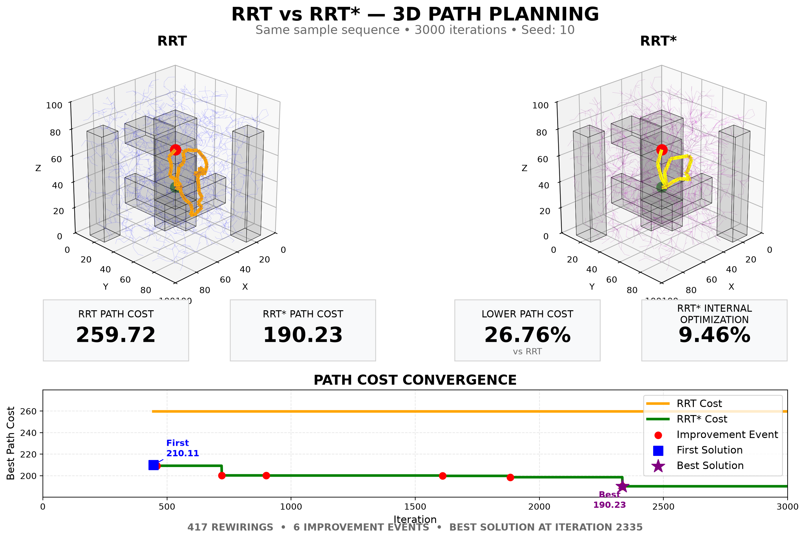
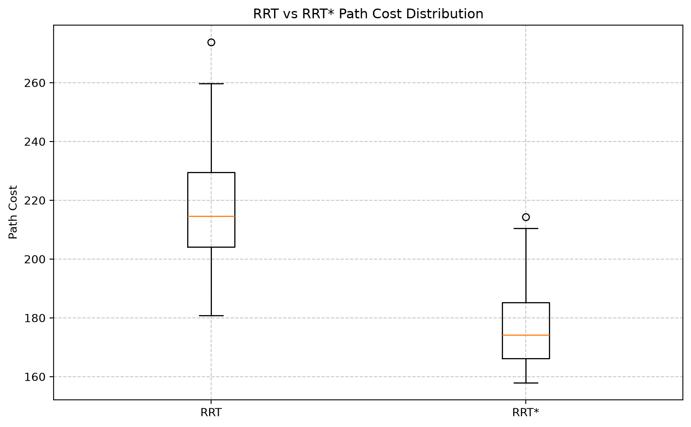
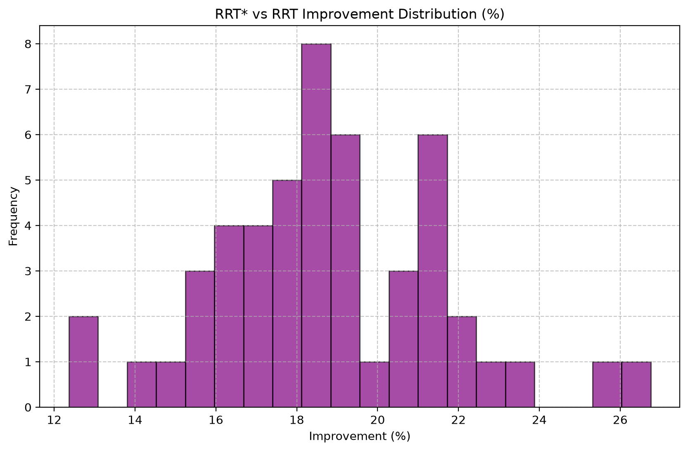
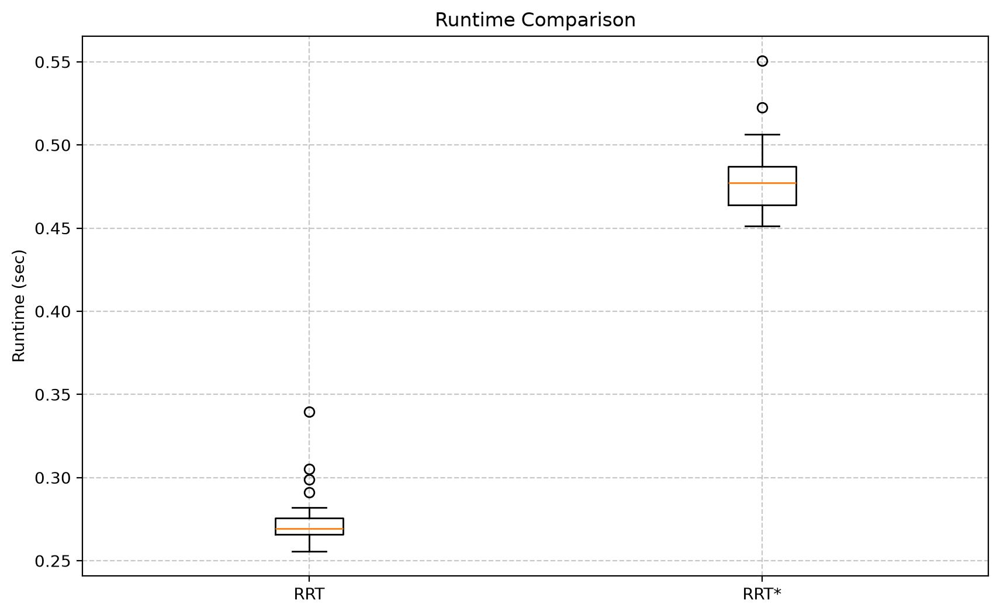

# RRT vs RRT* — 3D Path Planning & Benchmarking

Interactive 3D implementation and comparison of RRT and RRT* in Python, featuring identical sampling sequences, rewiring visualization, path-cost convergence, automated validation, and multi-seed benchmarking.



## Highlights

- RRT and RRT* implemented from scratch in Python
- Identical deterministic sample sequences for fair comparison
- 3D collision-aware planning with robot clearance
- RRT* parent selection and rewiring visualization
- Descendant cost propagation after rewiring
- Goal-candidate optimization
- Iteration-level path-cost convergence tracking
- Automated structural and cost-consistency validation
- Multi-seed benchmarking
- Presentation and export modes for visualization

## Representative Demo — Seed 10

Seed 10 was selected because it clearly visualizes post-solution RRT* convergence.

| Metric | RRT | RRT* |
|---|---:|---:|
| Final Path Cost | 259.72 | 190.23 |
| First Solution Cost | 259.72 | 210.11 |
| Rewirings | 0 | 417 |
| Improvement Events | 0 | 6 |
| Best Solution Iteration | 2335 | 2335 |

*RRT\* achieved a 26.76% lower raw path cost than RRT in this representative run.*

## RRT* Convergence

In Seed 10, the RRT* optimization history demonstrates continuous post-solution improvement:

`210.11` → `209.29` → `200.33` → `200.21` → `199.88` → `198.66` → `190.23`

RRT finds a valid path and keeps its original parent structure, while RRT* continues evaluating lower-cost parent connections and rewiring the tree.

## Multi-Seed Benchmark

Results apply to the tested 3D environment, parameter configuration, and 3,000-iteration budget. 

**Trials:** 100
**RRT Success Rate:** 100.0%
**RRT* Success Rate:** 100.0%

- **RRT Mean Path Cost:** 219.19
- **RRT* Mean Path Cost:** 177.14
- **RRT Median Path Cost:** 217.45
- **RRT* Median Path Cost:** 175.76

**Mean RRT* Path-Cost Reduction vs RRT:** 19.04%
**Median Reduction:** 18.77%

Across the 100 tested deterministic seeds in this environment, RRT* produced a lower final raw path cost in all comparable runs.

- **RRT* lower path cost:** 100 / 100 comparable runs
- **RRT lower path cost:** 0 / 100

**Mean Runtime:**
- **RRT:** 0.277 s
- **RRT*:** 0.486 s

### Path Cost Distribution



### Path Cost Reduction Distribution



### Runtime Trade-off



## Experimental Setup

- same 3D environment
- same START and GOAL
- same obstacles
- same iteration limit
- identical random sample sequence for RRT and RRT* within each seed
- 3,000 iterations
- deterministic seeds
- raw path cost used for primary comparison
- smoothing excluded from main RRT vs RRT* metric

## Algorithm Differences

| Feature | RRT | RRT* |
|---|---|---|
| Random sampling | ✓ | ✓ |
| Nearest-node expansion | ✓ | ✓ |
| Cost-aware parent selection | ✗ | ✓ |
| Rewiring | ✗ | ✓ |
| Descendant cost propagation | ✗ | ✓ |
| Continued cost optimization | ✗ | ✓ |

RRT* is asymptotically optimal under its standard theoretical assumptions.

## RRT* Pipeline

```text
Sample
→ Nearest
→ Steer
→ Collision Check
→ Near Nodes
→ Choose Minimum-Cost Parent
→ Add Node
→ Rewire
→ Update Descendant Costs
→ Evaluate Goal Candidates
→ Update Best Path
```

## Validation

The repository includes a comprehensive automated validation suite covering:

- No tree cycles
- Parent-child consistency
- Cost consistency
- Collision-free tree edges
- No zero-length edges
- Goal-candidate consistency
- Final path validation
- Final path collision validation
- Best-cost / extracted-path consistency
- Cost-history consistency
- Deterministic reset behavior
- Multi-seed regression testing

To run the validations locally:

```bash
python rrt_star_3d.py --test
python rrt_star_3d.py --test-multi-seed
```
